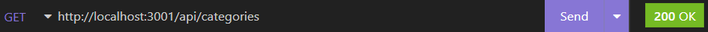
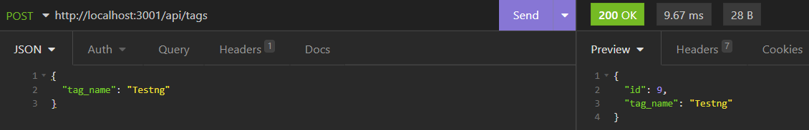
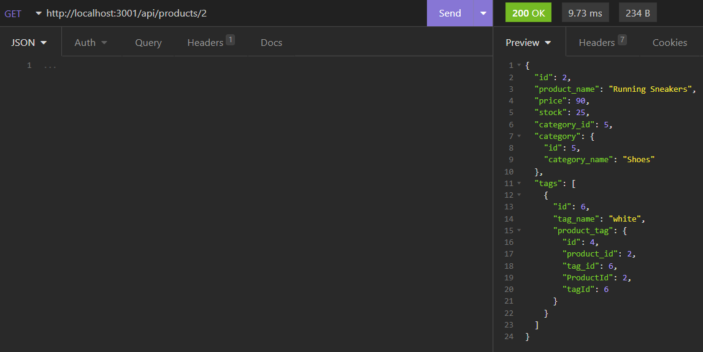

# e-commerce-back-end

E-commerce-back-end is a project demonstrating the use of a server connecting to a relational database using Sequelize and Mysql2, to create, read, update, and delete data from said database.  This project has no front end attached, use of a third party, http request testing platform such as Insomnia or Postman is required to API functionality.  

## Installation

Clone the repo to your computer.  Run "npm i" from the command line to install the npm packages as outlined in the package.json file.  Be sure to create a .env file in the root directory.  Inside the .env file, save the following:

* DB_NAME='ecommerce_db'
* DB_USER=''
* DB_PASSWORD=''

Enter your database user name and password within the quotes and save this file.  From mysql workbench or the mysql command line prompt if installed, the database must be created by sourcing the schema.sql file located in the db folder.  Next, seed the database.  From the command line type "npm run seed".  The express server can now be started, from the command line enter "npm start", or "npm run watch" if you have nodemon installed, and the server should now be listening on port 3001.

## Depencencies

The following npm pacakages are used in this project:

* Dotenv
* Express
* Mysql2
* Sequelize

## Conclusions

This project allowed me the opportunity to create an express server, create a mysql database, and connect to that database while protecting environment variables using the Dotenv npm package.  The Sequelize package was utilized to interact with the database, while I used Insomnia to test all api endpoints written.  I was able to step by step create each process, test, and see first hand how these components interact with eachother.  One component of this project which I found challenging, was correctly setting up model relationships with Sequelize.  Models which have many relationships, adds an extra level of complexity.  The next step going forward will be to implement a MVC architecture, createing a separation of concerns within my next project.

Please view my GitHub repo here:
 [e-commerce-back-end](https://github.com/ObviousEcho/e-commerce-back-end)

 A full video demonstration can be viewed here:
 [e-commerce-back-end](https://drive.google.com/file/d/1iM-61Zd79NlBJK9emDDuvF7zROI2a6bH/view)

 Thanks!